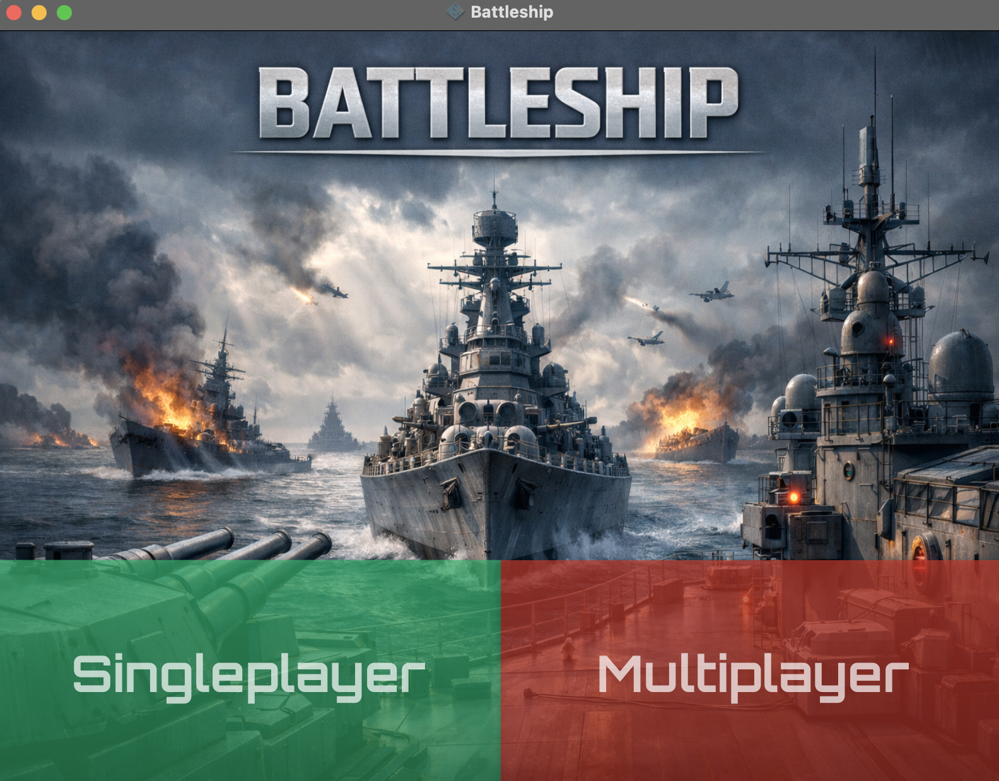
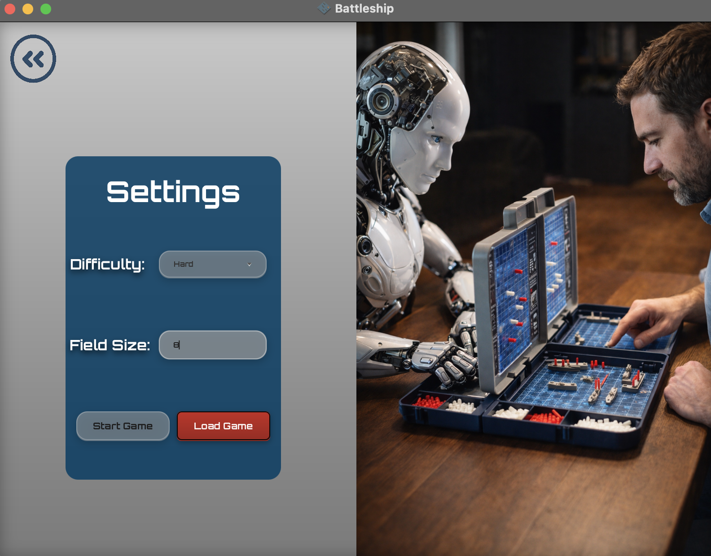
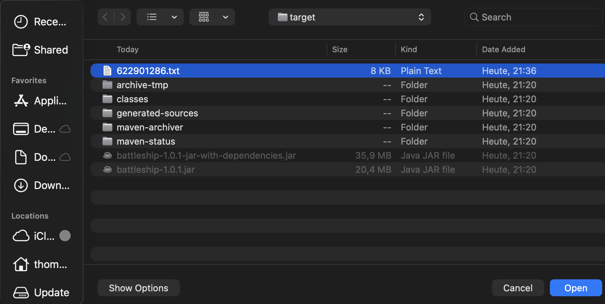
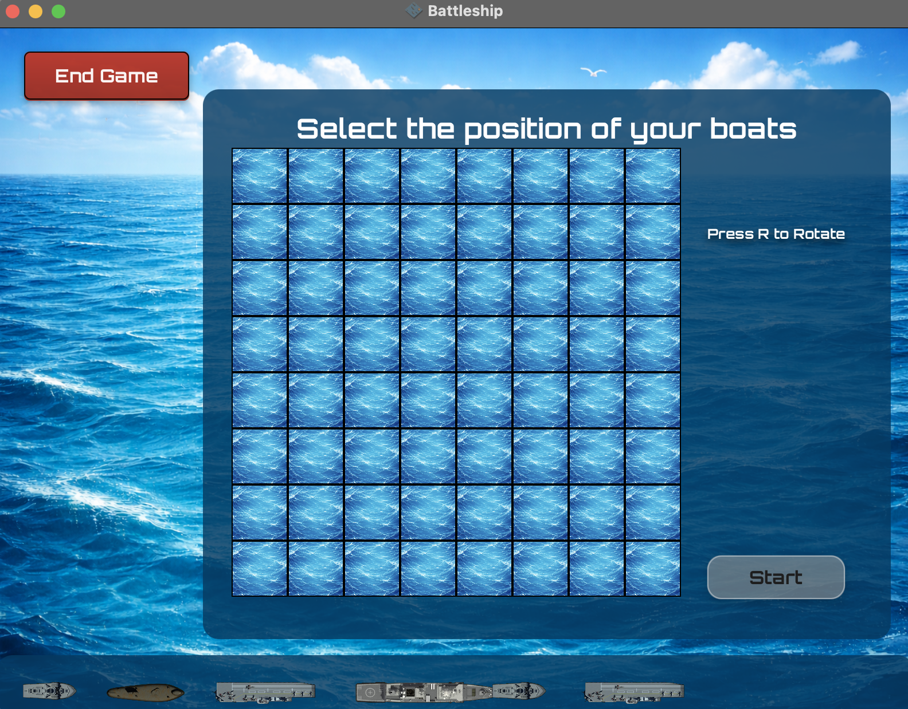
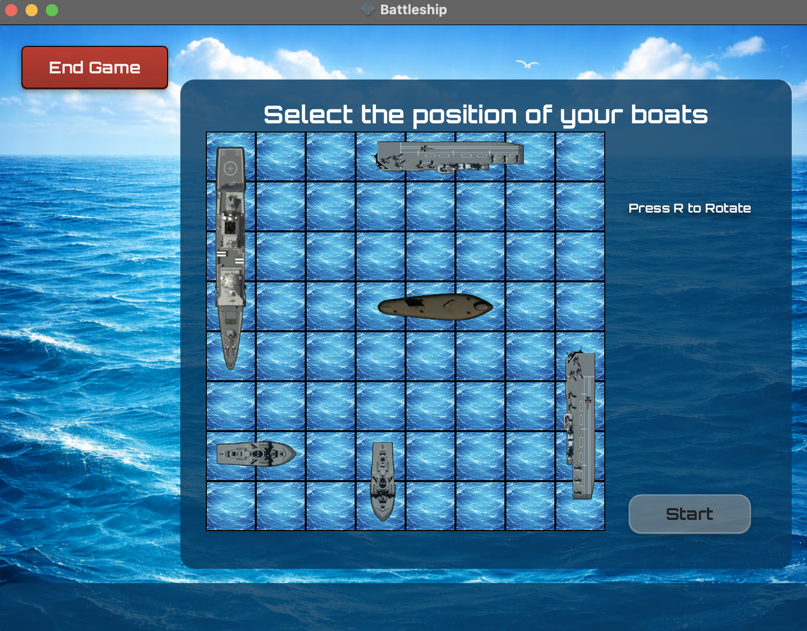
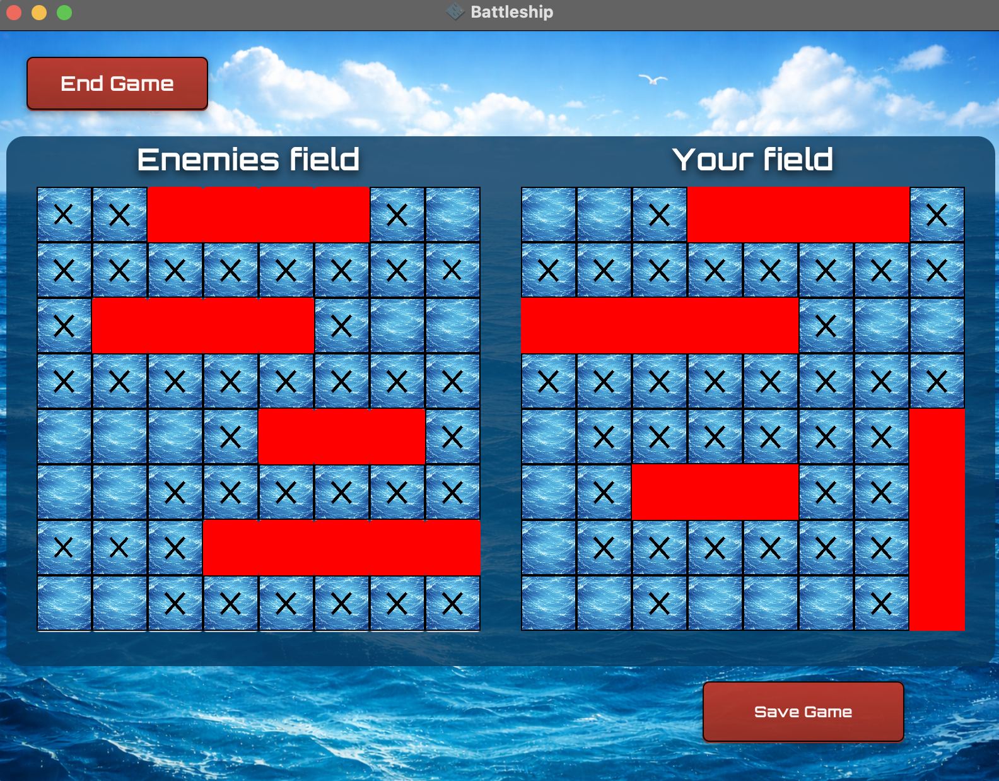
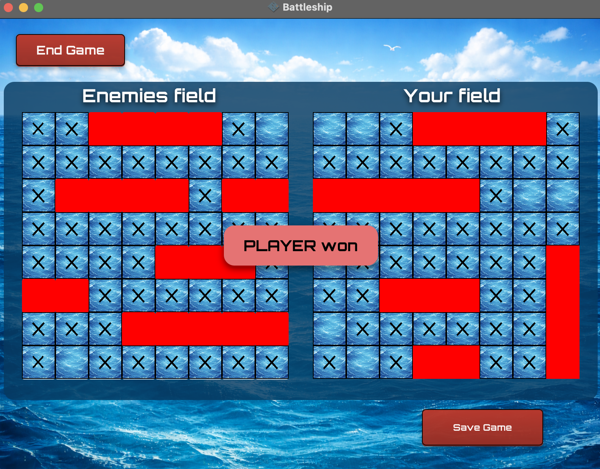
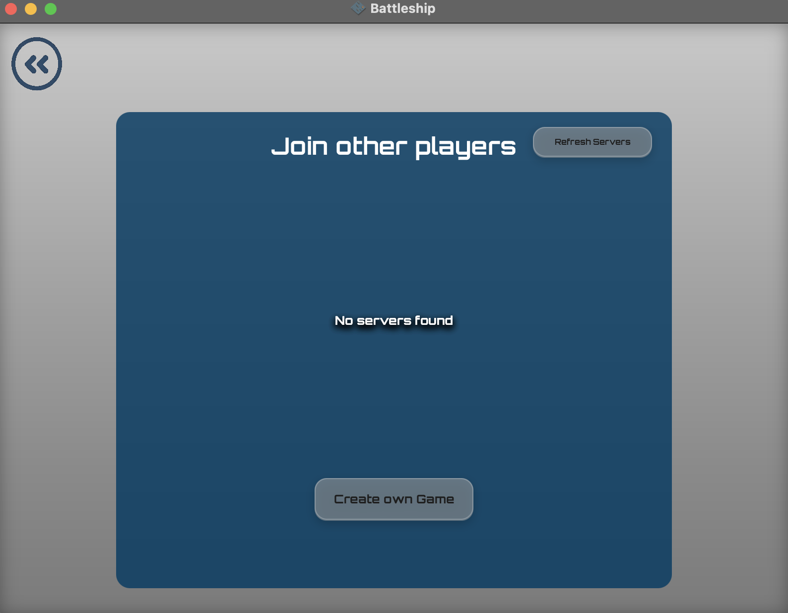
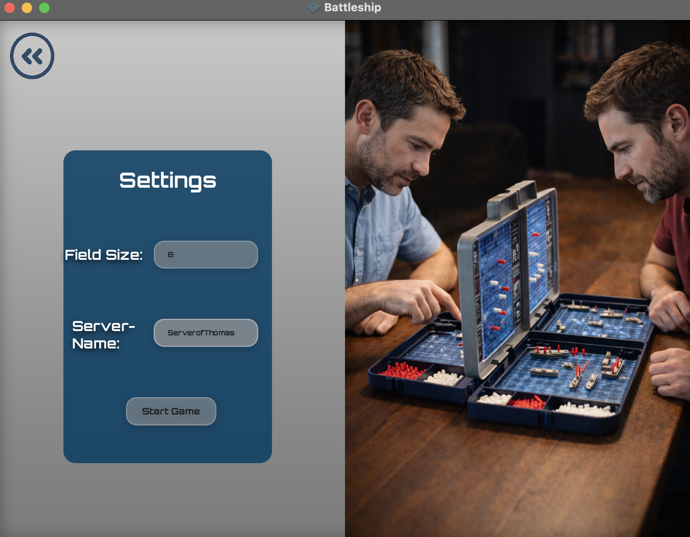
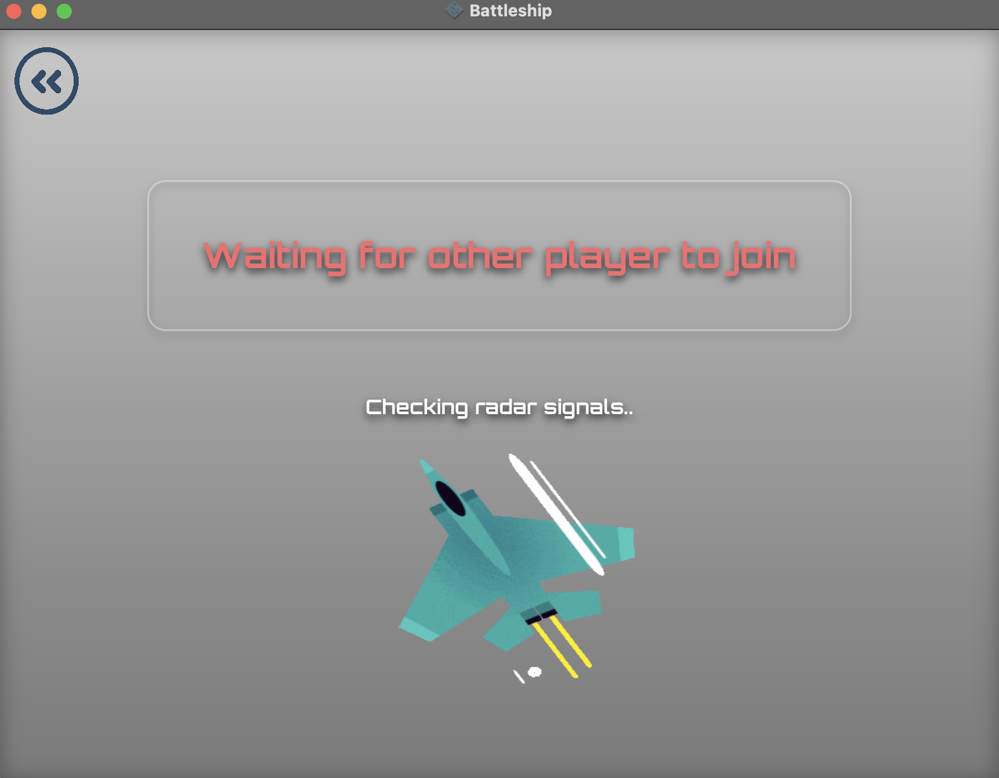

# Battleship

Project for the course "Programmierpraktikum Java".  
A graphical Battleship game implemented with Java and JavaFX.

## Table of Contents
- Overview
- Features
- Project Structure
- Technologies
- Installation
- Usage
    1. Start the application
    2. select desired game mode
    3. Singleplayer
    4. Multiplayer
    5. Create documentation
- Problems and Challenges
- Contributors
- License

## Overview
Battleship is a Java / JavaFX implementation of the classic Battleship game.  
The project combines game logic written in Java with a graphical user interface built using JavaFX.

The game supports singleplayer and multiplayer modes. In singleplayer mode, players compete against an  
AI with three difficulty levels (Easy, Medium, Hard), each featuring distinct shooting behavior.  
The board size is configurable between 3x3 and 12x12.

Multiplayer mode allows players to create and join lobbies on the local network using socket-based communication.  
The host can define the lobby name and board size.

## Features
- Classic Battleship gameplay (ship placement, input-validation, turn-based shooting, win/lose conditions)
- Singleplayer mode
  - AI opponent with three difficulty levels: Easy, Medium, Hard
  - being able to save game status and to load status later
- Multiplayer mode
  - Host and join lobbies via socket-based networking
  - Server/lobby browser with refresh (lists available lobbies)
- Configurable board size (3x3 to 12x12) in singleplayer and multiplayer
- JavaFX graphical user interface
- Drag-and-drop ship placement 
- Rotate ships after placement

## Project Structure
The project is divided into three main components:
- GUI layer implemented with JavaFX
- Game logic implemented in Java
- Networking layer based on socket communication

## Technologies
- used [Gradle](https://gradle.org/) for managing the [JAVA](https://www.java.com/) dependencies and builds
- communication protocol is HTTP using JAVA socket with JSON as data type for the payload
- This project uses [Apache Maven](https://maven.apache.org/install.html) for dependency management and build automation.
- [JFX](https://openjfx.io/) as GUI framework
    - [Tutorial Video](https://youtu.be/9YrmON6nlEw?si=Iqt_kq4Gv8PRQ8Zr)

## Installation
1. [git](https://github.com/) installed
2. [java](https://www.java.com/) installed: (version > 11 recommended)
3. open terminal and navigate into the directory where battleship should be installed
4. type in: `git clone https://github.com/M4tt1-Coder/battleship.git`

  

## Usage
1. Start the application:
   to start the program you have two options:  
   - starting via executable file 
   - starting with maven (commands work for Windows, Linux and MacOS)
     - compile: `mvn clean package`
     - execute jar file: `java -jar ./target/battleship-1.0.1-jar-with-dependencies.jar`  

2. After starting the application, select the desired game mode in the main menu.  

  
  
3. Singleplayer  
    a) In singleplayer mode, choose the board size and the AI difficulty level.
        The board size has to be between 5 and 30 cells.   
        Without any input the field size is initialized with 10.    
          
    b) Alternatively you can load a game out of a `.txt` file  
          
    c) Place your ships on the board using drag and drop, rotate them as needed, and start the game. 
        The rotation of the ship is only possible if the ship has been dragged and placed.  
          
          
    d) Players and AI take turns shooting until all ships of one side are destroyed.  
          
          
    e) You can always save the game by clicking on the "Save-Game-Button" and will be forwarded  
    to the game mode selection menu  

4. Multiplayer  
    a) In multiplayer mode, either host a new lobby or join an existing one on the local network.  
          
    b)The host defines the lobby name and board size.  
            
    c) The host has to wait until another player has joined  
          
    d) Once all players have joined, each player places their ships and the game begins with alternating turns. (see Singleplayer)    

During gameplay, all actions are performed via the graphical user interface.  
5. Create documentation  
   !The code has to be compiled before  
   Type in: `mvn javadoc:javadoc`  

## Contributors
- Matthis Geissler (@M4tt1-Coder) – core development, game logic
- Thomas Weigl (@Thomas-Weigl) – GUI
- Fabian Wottke (@WoFabian) – networking

## License
This project is licensed under the MIT License